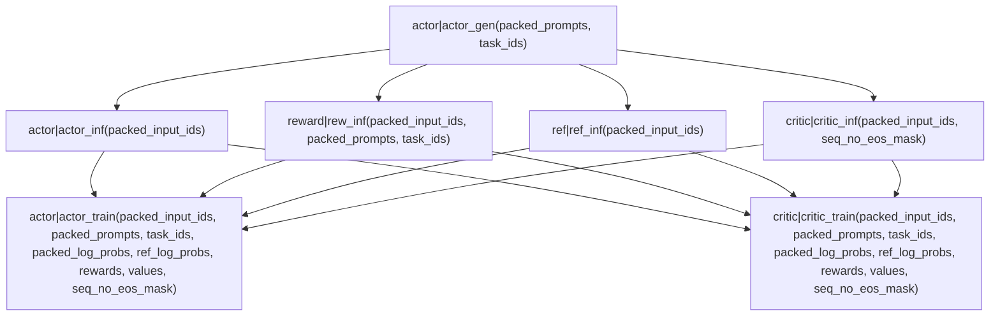

## 角色

分为推理和训练每个部分。训练部分将GenerationServer视为Dataset。

- 其中训练分为MasterWorker和ModelWorker两个角色。
  MasterWorker负责管理训练过程中的状态和调度，而ModelWorker为实际的训练Worker。

- 推理部分分为GenerationServer、RolloutWorker和GServerManager。
  GServerManager属于管控组件；GenerationServer运行SGLang推理服务；RolloutWorker负责与环境交互并收集数据。

### MasterWorker

核心调度组件FunctionExecutor，以Function为单位，按DAG执行。
每次调用FunctionExecutor.execute_step(), 会全图执行一遍。

### ModelWorker

### GenerationServer

核心是若干SGLangEngine实例，负责处理推理请求。

### RolloutWorker

负责与环境交互，收集数据并发送给MasterWorker。

- Loop
  - load_next_data
    - GSM.allocate_new_rollout
    - async agent.collect_trajectory
      - env.reset
      - Loop turn
        - obs_queue.put(obs)
        - act = act_queue.get()
        - success = env.step(act)
        - rewards, feedback = handle(success)
        - obs_queue.put(feedback)
    - GSM.finish_rollout
  - poll_queue_dispatch_task
    - rollout_response_queue -> act_queues[qid]
  - poll_inference_task
    - inference_maker.run_step()
      - poll_fresh_requests_task
        - request_queue -> GenerationServer
      - poll_old_requests_task
        - GenerationServer -> reply_queue
      - 总结：request_queue -> GenerationServer -> reply_queue

流程整理：主要维护多组Rollout的进行, 每个工作是:

- obs = [prompt]
- Loop turn
  - act = GenerationServer.generate_sequences(obs)
  - success = env.step(act)
  - rewards, feedback = handle(success)
  - obs.append(feedback)
- all_rewards, all_success

## Arealite

PR中，简化了Areal的架构，移除了DAG图，采用单控制器架构(Trainer)。
整体分为2部分：基于SGLang的推理部分和训练脚本(torch-run)。

训练脚本核心流程：

- dataset, dataloader
- rollout,eval_rollout: RemoteSGlangEngine
- actor,ref: FSDPPPOActor
- RLVRWorkflow
- Loop step
  - batch = rollout.prepare_batch(dataloader) / rollout.rollout_batch
  - logp = actor.compute_log_prob(batch)
  - ref = ref.compute_log_prob(batch)
  - actor.compute_advantages(batch)
  - actor.ppo_update(batch)
  - Update weights
    - rollout.pause()
    - rollout.update_weights_meta()
    - actor.upload_weights()
    - rollout.resume()
    - rollout.set_version()  
    - actor.set_version() // 应该移动到Loop开始
  - save
  - evaluate

其中prepare_batch是异步强化学习的核心，会向Rollout不断提交数据(>=batch_size)，轮询获取可用，攒够batch_size就返回。
而同步训练只提交batch_size大小的数据, 阻塞等待。
