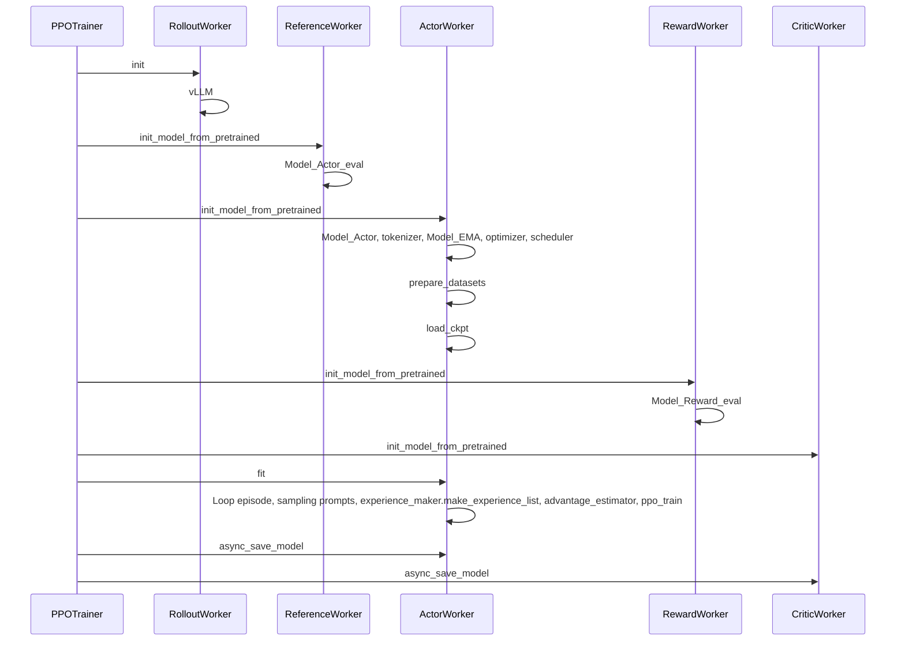

## PPO Trainer

## Note 4个月前进行了一次大改动，经验收集转移到Trainer中

控制流在Trainer内，核心流程：

- Loop episode
  - Loop sampling prompts
    - samples_generator.generate_samples
      - `vllm`.request
      - reward = `remote_reward_model`.get_rewards # required for dynamic_filtering
    - dynamic_filtering(samples)
    - experience_maker.make_experience_batch(samples)
      - reward = `reward_model_group`.forward
      - logprob = `actor_model_group`.forward
      - value = `critic_model_group`.forward
      - ref_logprob = `reference_model_group`.forward

    - `actor_model_group`.append(experience_batch) #batch
    - `critic_model_group`.append(experience_batch) #batch
    - ppo_train
      - `critic_model_group`.fit_async()
      - `actor_model_group`.fit()
      - `actor_model_group`._broadcast_to_vllm
      - wait `critic_model_group`.fit_async() done
  - save_logs_and_checkpoints
    - log % args.logging_steps
    - evaluate % args.eval_steps
      - samples_generator.generate_samples
      - `vllm`.request
      - reward = `remote_reward_model`.get_rewards
    - `actor/critic`.save_checkpoint % args.save_steps

## 角色具体功能

推理组件

- RewardModel: 负责计算奖励，也可以被`remote_rm_url`代替
- RolloutWorker：负责生成样本，通常包含`vllm`或`SGLang`推理框架及ENV
- Actor/Critic: 计算当前模型的logprob和value，用于各自的PPO更新Loss
- ReferenceModel: 负责计算参考模型的ref_logprob，用于计算KL散度

训练部分

- Actor/Critic：通过PPO进行训练
